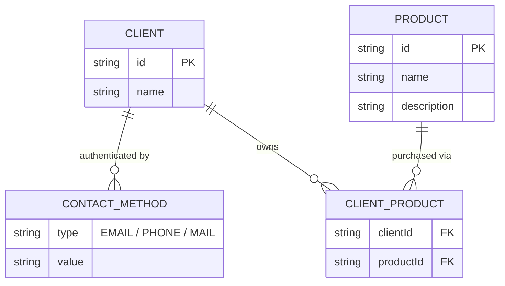

# Insurance System

Spring Boot REST API for insured client identification and product management.
No database — everything is stored in memory using `ConcurrentHashMap`.

## Requirements

- Java 17+
- Maven 3.8+

## How to run

```bash
mvn spring-boot:run
```

App starts on `http://localhost:8080`

Swagger UI available at `http://localhost:8080/swagger-ui.html`

---

## ERD



### Relations:
- One client → many contact methods
- Client ↔ Product is many-to-many
- Each client can own each product only once — enforced by `Set<Product>`
- `CONTACT_METHOD` has no surrogate PK — identity is `(clientId + type + value)` per requirements

---

## Endpoints

| Method | URL | Auth | Description |
|--------|-----|------|-------------|
| `POST` | `/api/clients/identify` | Client | Create or authenticate a client, returns their product list |
| `POST` | `/api/clients/{clientId}/products/{productId}/buy` | Client | Authenticated client buys a product |
| `POST` | `/api/products` | Admin headers | Add a new product to the catalog |
| `PUT`  | `/api/products/{id}` | Admin headers | Update an existing product |
| `GET`  | `/api/products` | None | List all products |
| `GET`  | `/api/products/{id}` | None | Get a single product |

Admin endpoints require `X-Admin-Username` and `X-Admin-Password` headers.
Credentials are defined in `application.properties`.

---

## What's missing in the original diagrams

**Diagram 1** shows: create client → authenticate → get product list

**Diagram 2** shows: buy new product → data store / update product → data store

There are two things missing:

**1. The connection between the two diagrams**
Diagram 1 ends with "get client product list" and Diagram 2 shows a client buying
a product, but there is no arrow or flow connecting them. A client needs to be
authenticated first (Diagram 1) before they can buy (Diagram 2).
This is implemented as `POST /api/clients/{clientId}/products/{productId}/buy`
which authenticates the client before assigning the product.

**2. No admin flow anywhere**
The diagrams only cover client actions. But someone needs to add products to
the catalog before any client can buy them. There is no diagram showing who
creates or manages the product catalog.
This is implemented as the admin-protected `POST /api/products` and
`PUT /api/products/{id}` endpoints, secured via request headers.
In production this would use Spring Security with `@PreAuthorize("hasRole('ADMIN')")`.

---

## Postman

Import `Insurance_System_API_postman_collection.json` into Postman.

Run in this order:
1. Create Product (Admin) — requires admin headers
2. Create Product wrong credentials → expect `401`
3. Update Product (Admin)
4. Identify NEW Client
5. Assign Product to Client
6. Verify — Identify after buying → should now return the product in the list
7. Duplicate Product Assignment → expect `409 Conflict`
8. Unauthorized Client → expect `401 Unauthorized`

---

## Tests

```bash
mvn test
```

12 unit tests covering: client creation, authentication flows, product purchase, and all error cases.
